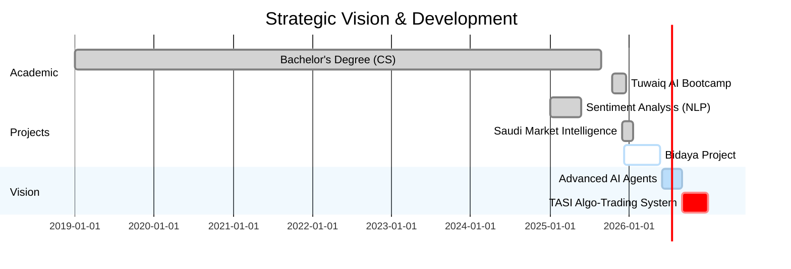

# Hi there, I'm Abdulrahman Saad Asiri

### Financial Data Scientist | AI Engineer | CMT Candidate

  

---

## About Me

Data Scientist in the financial sector, dedicated to building smart financial tools and accurate predictive models with a specific focus on the **Saudi Market (Tadawul)**.

- **Financial Data Science:** Applying statistical methods to analyze financial datasets and economic trends
- **Technical Analysis:** Pursuing the **Chartered Market Technician (CMT)** designation
- **AI Engineering:** Optimizing LLMs to interpret Arabic financial reports and market data

---

## Featured Projects

<table>
<tr>
<td width="50%">

### [Saudi Market Intelligence](https://github.com/Abdulrahman-S-Asiri/saudi-market-intelligence)
AI-powered stock analysis platform for Tadawul featuring LSTM neural networks, ensemble ML models, and real-time trading signals.

</td>
<td width="50%">

### [SA-Retrieval-Embeddings](https://huggingface.co/Omartificial-Intelligence-Space/SA-Retrieval-Embeddings-0.2B)
Semantic embedding model specialized for RAG systems in Saudi Dialect with high-precision semantic search.

</td>
</tr>
<tr>
<td width="50%">

### [SAFIR Leaderboard](https://huggingface.co/spaces/NAMAA-Space/SAFIR-Leaderboard)
Comprehensive benchmark for evaluating Saudi Arabic LLMs with standardized performance metrics.

</td>
<td width="50%">

### [Cyber Awareness](https://github.com/Abdulrahman-S-Asiri/Cyber-Awareness)
Interactive cybersecurity awareness platform with educational resources for online safety.

</td>
</tr>
</table>

---

## Tech Stack

| **AI & ML** | **Data & Finance** | **Development** |
|:---:|:---:|:---:|
|  |  |  |
|  |  |  |
|  |  |  |
|  |  |  |

---

## Education & Certifications

<table>
<tr>
<td width="50%">

### Education
- **B.Sc. Computer Science** - Majmaah University
- **Data Science & AI Bootcamp** - Tuwaiq Academy

</td>
<td width="50%">

### Certifications
- **CMT Association** - Chartered Market Technician (Candidate)
- **DataCamp** - Data Scientist Associate
- **NVIDIA** - Deep Learning Fundamentals
- **Udemy** - Machine Learning A-Z

</td>
</tr>
</table>

---

## Leadership Experience

**Head of Investment Committees** | *Majmaah University Investment Club*
> Taught technical analysis and financial markets to students, providing practical skills for informed investment decisions.

**Head of Financial Analysis Committee** | *Majmaah University Investment Club*
> Led a team analyzing investment opportunities, prepared financial reports, and organized modeling workshops.

---

## Career Roadmap

---

### GitHub Stats

---

*"Bridging traditional market analysis with cutting-edge AI to unlock insights in the Saudi financial market."*

