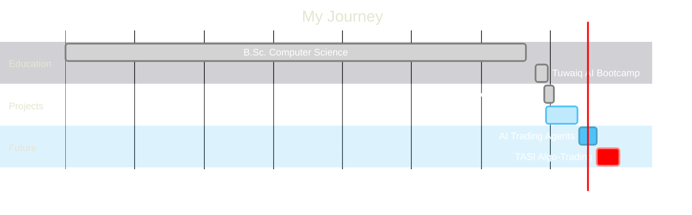

<div align="center">

[;Bridging+Traditional+Analysis+%26+Machine+Learning)](https://git.io/typing-svg)

<br/>

[](https://www.linkedin.com/in/abdulrahman-saad-asiri-573ba1200)
[](https://x.com/D7oomyStay)
[](https://huggingface.co/Omartificial-Intelligence-Space)
[](https://github.com/Abdulrahman-S-Asiri)

</div>

<br/>

## About Me

```javascript
const abdulrahman = {
    role: "Financial Data Scientist & AI Engineer",
    location: "Saudi Arabia",
    focus: ["Saudi Market (Tadawul)", "Arabic Financial LLMs", "Algorithmic Trading"],
    currentlyWorking: "Bidaya - AI Mock Interview Coach",
    pursuing: "Chartered Market Technician (CMT)",

    skills: {
        ai_ml: ["PyTorch", "Transformers", "Scikit-Learn", "XGBoost", "LSTM"],
        data: ["Pandas", "NumPy", "SQL", "Tableau", "yfinance"],
        backend: ["FastAPI", "Python", "REST APIs"],
        frontend: ["React", "JavaScript", "CSS"],
        tools: ["Docker", "Git", "Linux", "Jupyter"]
    },

    mission: "Bridging traditional market analysis with cutting-edge AI"
};
```

<br/>

<!-- GitHub Trophies -->
<div align="center">
  
</div>

<br/>


## Featured Projects

<div align="center">

<a href="https://github.com/Abdulrahman-S-Asiri/saudi-market-intelligence">
  
</a>
<a href="https://github.com/Abdulrahman-S-Asiri/Cyber-Awareness">
  
</a>

</div>

### AI & NLP Contributions

<table>
<tr>
<td width="50%" valign="top">

**[SA-Retrieval-Embeddings-0.2B](https://huggingface.co/Omartificial-Intelligence-Space/SA-Retrieval-Embeddings-0.2B)**

Semantic embedding model for RAG systems in Saudi Dialect. Optimized for high-precision semantic search.


</td>
<td width="50%" valign="top">

**[SAFIR Leaderboard](https://huggingface.co/spaces/NAMAA-Space/SAFIR-Leaderboard)**

Benchmark for evaluating Saudi Arabic LLMs with standardized metrics.


</td>
</tr>
</table>

<br/>


## Tech Stack

<div align="center">

### AI & Machine Learning


### Data & Analytics


### Development


</div>

<br/>


## GitHub Analytics

<div align="center">
  <picture>
    <source media="(prefers-color-scheme: dark)" srcset="https://github-readme-stats.vercel.app/api?username=Abdulrahman-S-Asiri&show_icons=true&theme=tokyonight&hide_border=true&bg_color=0D1117&title_color=4FC3F7&icon_color=4FC3F7&text_color=ffffff&cache_seconds=86400" />
    <source media="(prefers-color-scheme: light)" srcset="https://github-readme-stats.vercel.app/api?username=Abdulrahman-S-Asiri&show_icons=true&theme=default&hide_border=true&cache_seconds=86400" />
    
  </picture>
  <picture>
    <source media="(prefers-color-scheme: dark)" srcset="https://github-readme-stats.vercel.app/api/top-langs/?username=Abdulrahman-S-Asiri&layout=compact&theme=tokyonight&hide_border=true&bg_color=0D1117&title_color=4FC3F7&text_color=ffffff&cache_seconds=86400" />
    <source media="(prefers-color-scheme: light)" srcset="https://github-readme-stats.vercel.app/api/top-langs/?username=Abdulrahman-S-Asiri&layout=compact&theme=default&hide_border=true&cache_seconds=86400" />
    
  </picture>
</div>

<div align="center">
  <picture>
    <source media="(prefers-color-scheme: dark)" srcset="https://streak-stats.demolab.com?user=Abdulrahman-S-Asiri&theme=tokyonight&hide_border=true&background=0D1117&ring=4FC3F7&fire=FF6B6B&currStreakLabel=4FC3F7" />
    <source media="(prefers-color-scheme: light)" srcset="https://streak-stats.demolab.com?user=Abdulrahman-S-Asiri&theme=default&hide_border=true" />
    
  </picture>
</div>

<br/>

<!-- Activity Graph -->
<div align="center">
  
</div>

<br/>

<!-- Contribution Snake Animation -->
<div align="center">
  <picture>
    <source media="(prefers-color-scheme: dark)" srcset="https://raw.githubusercontent.com/Abdulrahman-S-Asiri/Abdulrahman-S-Asiri/output/github-snake-dark.svg" />
    <source media="(prefers-color-scheme: light)" srcset="https://raw.githubusercontent.com/Abdulrahman-S-Asiri/Abdulrahman-S-Asiri/output/github-snake.svg" />
    
  </picture>
</div>

<br/>


## Education & Credentials

<div align="center">

| Education | Certifications |
|:---:|:---:|
| **B.Sc. Computer Science** | **CMT** - Chartered Market Technician (Candidate) |
| Majmaah University | CMT Association |
| **Data Science & AI Bootcamp** | **Data Scientist Associate** |
| Tuwaiq Academy | DataCamp |
| | **Deep Learning Fundamentals** - NVIDIA |

</div>

<br/>

## Leadership

<div align="center">

| Role | Organization |
|:---|:---|
| **Head of Investment Committees** | Investment Club, Majmaah University |
| **Head of Financial Analysis Committee** | Investment Club, Majmaah University |

</div>

> *Taught technical analysis to students and led teams analyzing investment opportunities*

<br/>

## Career Roadmap



<br/>


<!-- Spotify Now Playing - Connect your account at https://spotify-github-profile.kittinanx.com/ -->
<!--
<div align="center">

## Now Playing

[](https://spotify-github-profile.kittinanx.com/api/view?uid=YOUR_SPOTIFY_USER_ID&redirect=true)

</div>
-->

<div align="center">

---

### Let's Connect!

<a href="https://www.linkedin.com/in/abdulrahman-saad-asiri-573ba1200">
  
</a>

<br/><br/>

**"Transforming market data into actionable intelligence through AI"**

<br/>


</div>
