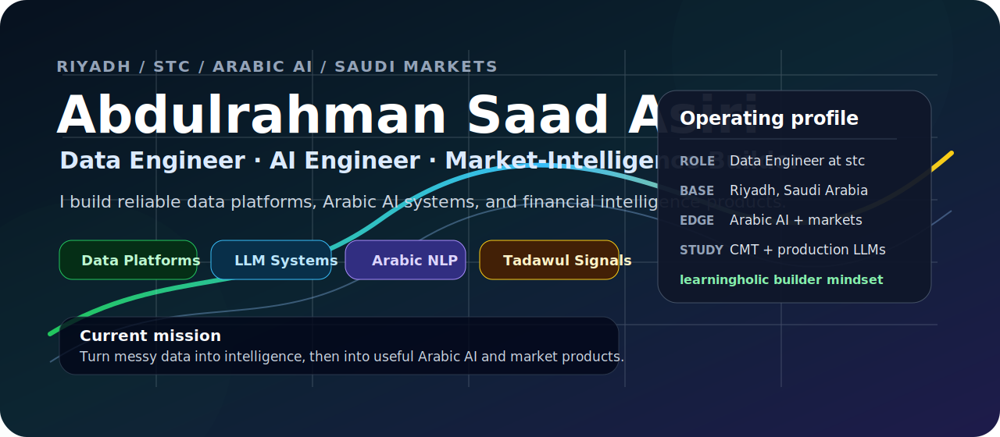
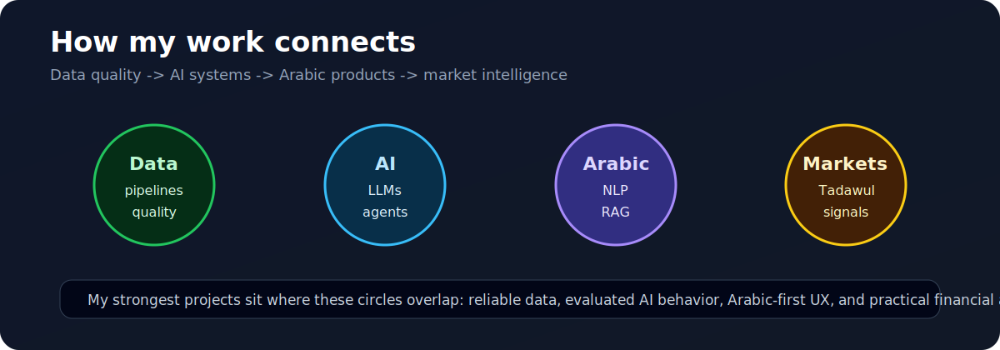
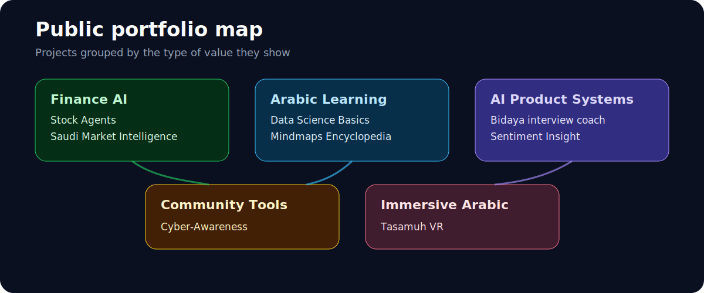

<div align="center">
  
</div>

<p align="center">
  <a href="https://www.linkedin.com/in/abdulrahman-saad-asiri-573ba1200">
    
  </a>
  <a href="https://x.com/D7oomyStay">
    
  </a>
  <a href="https://huggingface.co/Abdulrahman-S-Asiri">
    
  </a>
  <a href="mailto:abdulrahman.s.alasiri@gmail.com">
    
  </a>
</p>

---

## About Me | نبذة عني

I am **Abdulrahman Saad Asiri**, a **Data Engineer at stc** in Riyadh, Saudi Arabia. I build at the intersection of **data engineering**, **AI systems**, **Arabic NLP**, and **financial markets**.

I describe myself as a **learningholic**: if a field can improve how I build, analyze, or invest, I study it deeply. My current direction is clear: build production-grade AI products, especially for Arabic users and market-intelligence workflows.

| What is real about me | Details |
|:---|:---|
| Current role | Data Engineer at stc |
| Based in | Riyadh, Saudi Arabia |
| Main technical focus | LLMs, embeddings, agentic systems, data platforms, Arabic NLP |
| Market focus | Saudi stock market, Tadawul, technical analysis, quant research |
| Currently studying | CMT Program, production LLM systems, large-scale data architecture |
| Builder mindset | Turn messy data into usable intelligence, then into real products |

---

## My Builder Map

<div align="center">
  
</div>

---

## Signature Projects

<div align="center">
  
</div>

| Project | Why it matters | Stack |
|:---|:---|:---|
| [Stock Agents](https://github.com/Abdulrahman-S-Asiri/Stock_Agents) | Investment platform with 11 specialized AI agents, dual-market coverage, portfolio analytics, and real-time data | Next.js, TypeScript, FastAPI, PostgreSQL, Redis, Docker |
| [Saudi Market Intelligence](https://github.com/Abdulrahman-S-Asiri/saudi-market-intelligence) | Tadawul-focused market intelligence with technical features, confidence scoring, scanner workflows, and portfolio tracking | Python, PyTorch, FastAPI, React, Tailwind CSS |
| [Data Science Basics](https://github.com/Abdulrahman-S-Asiri/Data_Science_Basics) | Bilingual Arabic/English data science path built to help learners move from basics to applied notebooks | Python, Jupyter, pandas, scikit-learn |
| [Bidaya](https://github.com/Abdulrahman-S-Asiri/Bidaya_v2) | Arabic/English AI interview coach with voice pipeline, resume analysis, feedback loops, and analytics | React, Flask, OpenAI APIs, Vite |
| [Mindmaps Encyclopedia](https://github.com/Abdulrahman-S-Asiri/Mindmaps) | Interactive mindmaps for learning technical domains with generated HTML outputs | Python, HTML, CSS |
| [Cyber-Awareness](https://github.com/Abdulrahman-S-Asiri/Cyber-Awareness) | Arabic-first cybersecurity awareness training with incident-response guidance | HTML, CSS, JavaScript |

---

## Open Source And Research

| Contribution | Focus | Link |
|:---|:---|:---|
| SA-Retrieval Embeddings 0.2B | Retrieval-optimized embedding model for Saudi Arabic RAG systems | [Hugging Face](https://huggingface.co/Omartificial-Intelligence-Space/SA-Retrieval-Embeddings-0.2B) |
| SAFIR Leaderboard | Arabic AI benchmark and model-evaluation leaderboard by NAMAA | [Hugging Face Space](https://huggingface.co/spaces/NAMAA-Space/SAFIR-Leaderboard) |

---

## Stack Snapshot

<div align="center">

| AI / ML | Data | Backend | Frontend | Markets |
|:---:|:---:|:---:|:---:|:---:|
| PyTorch | PostgreSQL | FastAPI | React | Tadawul |
| Transformers | Redis | Flask | Next.js | US equities |
| Embeddings | pandas | REST APIs | TypeScript | Technical analysis |
| RAG | NumPy | WebSockets | Tailwind CSS | Portfolio analytics |
| Agents | SQL | Docker | Vite | Quant research |

</div>

---

## Education, Certifications, And Leadership

| Area | Details |
|:---|:---|
| Education | B.Sc. Computer Science, Majmaah University |
| Training | Data Science & AI Bootcamp, Tuwaiq Academy |
| Certifications | Data Scientist Associate, DataCamp; Deep Learning Fundamentals, NVIDIA |
| Finance path | CMT Candidate, Chartered Market Technician Program |
| Leadership | Head of Investment Committees and Head of Financial Analysis, Investment Club |

---

## What I Am Building Toward

```text
Arabic AI products
  -> reliable retrieval
  -> measurable model behavior
  -> useful interfaces
  -> production deployment

Saudi market intelligence
  -> cleaner data pipelines
  -> better signals
  -> portfolio-aware decisions
  -> explainable analysis
```

---

## GitHub Analytics

<div align="center">
  
  
</div>

<br>

<div align="center">
  
</div>

---

## How I Work

- I care about systems that actually run, not just demos.
- I like projects that connect data, AI, and real decision-making.
- I document architecture, tradeoffs, and limitations so another engineer can understand the work.
- I use AI tools as engineering assistants, but I keep ownership of the decisions, review, testing, and final result.

---

<p align="center">
  <strong>Open to collaborations in AI engineering, data platforms, Arabic NLP, and market-intelligence systems.</strong>
</p>

<p align="center">
  <a href="mailto:abdulrahman.s.alasiri@gmail.com">Email</a>
  &nbsp;|&nbsp;
  <a href="https://www.linkedin.com/in/abdulrahman-saad-asiri-573ba1200">LinkedIn</a>
  &nbsp;|&nbsp;
  <a href="https://huggingface.co/Abdulrahman-S-Asiri">Hugging Face</a>
</p>
