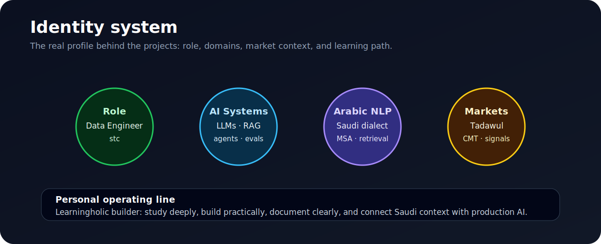
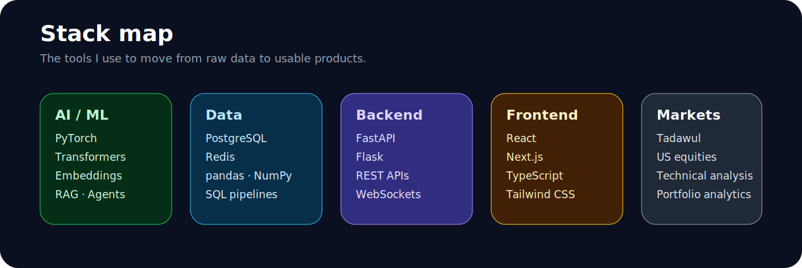
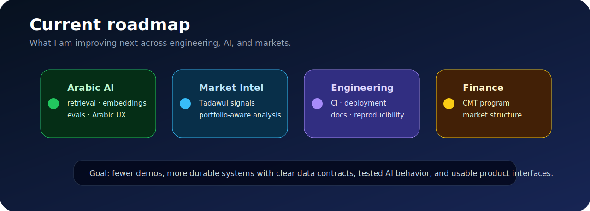

  

  <a href="#identity">Identity</a>
  &nbsp;•&nbsp;
  <a href="#portfolio">Portfolio</a>
  &nbsp;•&nbsp;
  <a href="#research">Research</a>
  &nbsp;•&nbsp;
  <a href="#stack">Stack</a>
  &nbsp;•&nbsp;
  <a href="#roadmap">Roadmap</a>
  &nbsp;•&nbsp;
  <a href="#contact">Contact</a>

  
  
  
  

---

## Identity

I am **Abdulrahman Saad Asiri**, a **Data Engineer at stc** based in **Riyadh, Saudi Arabia**. My work sits where data platforms, AI systems, Arabic language technology, and financial markets meet.

I am building toward one clear direction: **production-grade AI products for Arabic users and market-intelligence workflows**. I care about useful systems, not only impressive demos: clean data, measurable model behavior, readable interfaces, and decisions that can be explained.

  

---

## Portfolio

  

<strong>Project details</strong>

 

| Project | Why it represents me | Stack |
|:---|:---|:---|
| [Stock Agents](https://github.com/Abdulrahman-S-Asiri/Stock_Agents) | 11-agent investment analysis platform, dual-market coverage, portfolio analytics, real-time data | Next.js, TypeScript, FastAPI, PostgreSQL, Redis, Docker |
| [Saudi Market Intelligence](https://github.com/Abdulrahman-S-Asiri/saudi-market-intelligence) | Tadawul-focused intelligence system with technical features, confidence scoring, scanner workflows, and portfolio tracking | Python, PyTorch, FastAPI, React, Tailwind CSS |
| [Data Science Basics](https://github.com/Abdulrahman-S-Asiri/Data_Science_Basics) | Bilingual Arabic/English data science learning path from fundamentals to applied notebooks | Python, Jupyter, pandas, scikit-learn |
| [Bidaya](https://github.com/Abdulrahman-S-Asiri/Bidaya_v2) | Arabic/English AI interview coach with voice pipeline, resume analysis, feedback loops, and analytics | React, Flask, OpenAI APIs, Vite |
| [Mindmaps Encyclopedia](https://github.com/Abdulrahman-S-Asiri/Mindmaps) | Interactive knowledge maps for learning technical domains through generated HTML | Python, HTML, CSS |
| [Cyber-Awareness](https://github.com/Abdulrahman-S-Asiri/Cyber-Awareness) | Arabic-first cybersecurity awareness training with incident-response guidance | HTML, CSS, JavaScript |

---

## Research

| Contribution | Focus | Link |
|:---|:---|:---|
| **SA-Retrieval Embeddings 0.2B** | Retrieval-optimized embedding model for Saudi Arabic RAG systems | [Hugging Face](https://huggingface.co/Omartificial-Intelligence-Space/SA-Retrieval-Embeddings-0.2B) |
| **SAFIR Leaderboard** | Arabic AI benchmark and model-evaluation leaderboard by NAMAA | [Hugging Face Space](https://huggingface.co/spaces/NAMAA-Space/SAFIR-Leaderboard) |

---

## Stack

  

---

## Roadmap

  

| Track | Current direction |
|:---|:---|
| Arabic AI | Retrieval, embeddings, evaluation, Arabic-first UX |
| Market intelligence | Tadawul data, signals, portfolio-aware analysis, technical research |
| Engineering maturity | CI, deployment, documentation, reproducible builds |
| Finance learning | CMT Program, market structure, technical analysis discipline |

---

## Experience And Education

| Area | Details |
|:---|:---|
| Current role | Data Engineer at stc |
| Education | B.Sc. Computer Science, Majmaah University |
| Training | Data Science & AI Bootcamp, Tuwaiq Academy |
| Certifications | Data Scientist Associate, DataCamp; Deep Learning Fundamentals, NVIDIA |
| Finance path | CMT Candidate, Chartered Market Technician Program |
| Leadership | Head of Investment Committees and Head of Financial Analysis, Investment Club |

---

## GitHub Activity

  
  

 

  

---

## How I Work

- I turn messy data into usable intelligence, then into products people can operate.
- I use AI tools as engineering assistants, but I keep ownership of decisions, review, tests, and final quality.
- I prefer specific claims backed by code, screenshots, docs, evaluation, or working deployments.
- I care about Arabic users, Saudi market context, and products that feel real.

---

## Contact

  <strong>Open to collaborations in AI engineering, data platforms, Arabic NLP, and market-intelligence systems.</strong>

  <a href="mailto:abdulrahman.s.alasiri@gmail.com">Email</a>
  &nbsp;|&nbsp;
  <a href="https://www.linkedin.com/in/abdulrahman-saad-asiri-573ba1200">LinkedIn</a>
  &nbsp;|&nbsp;
  <a href="https://huggingface.co/Abdulrahman-S-Asiri">Hugging Face</a>

