<!-- The portfolio block is generated. Edit profile copy below or portfolio/projects.json. -->
<!-- portfolio:start -->

<picture>
  <source media="(max-width: 600px) and (prefers-color-scheme: dark)" srcset="assets/portfolio/banner-mobile-dark.svg">
  <source media="(max-width: 600px) and (prefers-color-scheme: light)" srcset="assets/portfolio/banner-mobile-light.svg">
  <source media="(prefers-color-scheme: dark)" srcset="assets/portfolio/banner-dark.svg">
  <source media="(prefers-color-scheme: light)" srcset="assets/portfolio/banner-light.svg">
  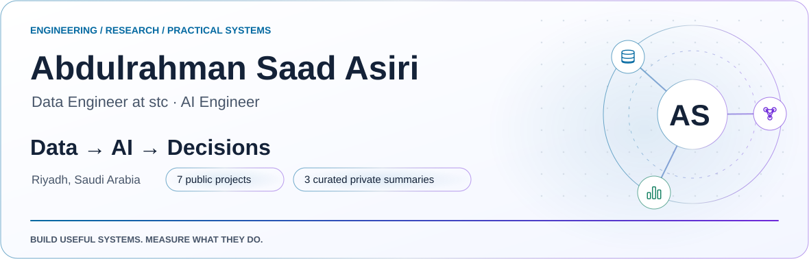
</picture>

Public sources checked on <strong>2026-10-09 UTC</strong> · 7/7 source checks succeeded

<picture>
  <source media="(max-width: 600px) and (prefers-color-scheme: dark)" srcset="assets/portfolio/map-mobile-dark.svg">
  <source media="(max-width: 600px) and (prefers-color-scheme: light)" srcset="assets/portfolio/map-mobile-light.svg">
  <source media="(prefers-color-scheme: dark)" srcset="assets/portfolio/map-dark.svg">
  <source media="(prefers-color-scheme: light)" srcset="assets/portfolio/map-light.svg">
  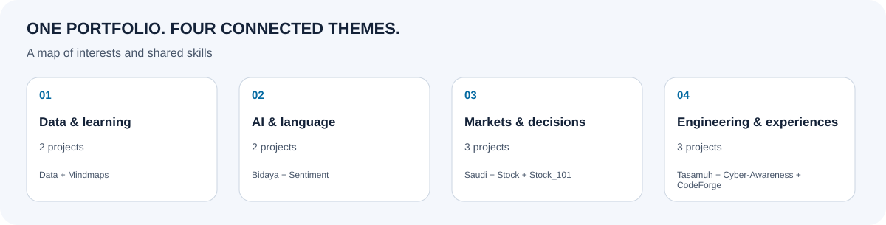
</picture>

## Selected work · مشاريع مختارة

<a href="https://github.com/Abdulrahman-S-Asiri/saudi-market-intelligence"><picture>
  <source media="(max-width: 600px) and (prefers-color-scheme: dark)" srcset="assets/portfolio/saudi-market-intelligence-mobile-dark.svg">
  <source media="(max-width: 600px) and (prefers-color-scheme: light)" srcset="assets/portfolio/saudi-market-intelligence-mobile-light.svg">
  <source media="(prefers-color-scheme: dark)" srcset="assets/portfolio/saudi-market-intelligence-dark.svg">
  <source media="(prefers-color-scheme: light)" srcset="assets/portfolio/saudi-market-intelligence-light.svg">
  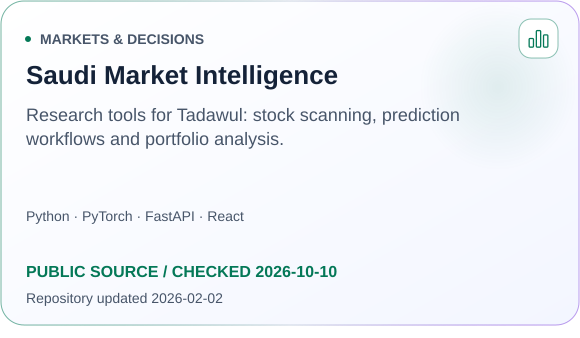
</picture></a>
<a href="https://github.com/Abdulrahman-S-Asiri/Data_Science_Basics"><picture>
  <source media="(max-width: 600px) and (prefers-color-scheme: dark)" srcset="assets/portfolio/data-science-basics-mobile-dark.svg">
  <source media="(max-width: 600px) and (prefers-color-scheme: light)" srcset="assets/portfolio/data-science-basics-mobile-light.svg">
  <source media="(prefers-color-scheme: dark)" srcset="assets/portfolio/data-science-basics-dark.svg">
  <source media="(prefers-color-scheme: light)" srcset="assets/portfolio/data-science-basics-light.svg">
  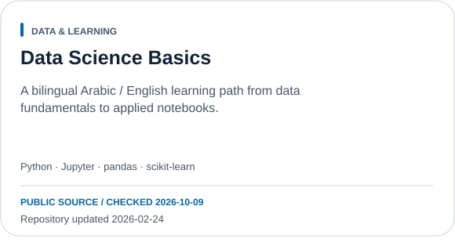
</picture></a>
<a href="https://github.com/Abdulrahman-S-Asiri/Bidaya_v2"><picture>
  <source media="(max-width: 600px) and (prefers-color-scheme: dark)" srcset="assets/portfolio/bidaya-mobile-dark.svg">
  <source media="(max-width: 600px) and (prefers-color-scheme: light)" srcset="assets/portfolio/bidaya-mobile-light.svg">
  <source media="(prefers-color-scheme: dark)" srcset="assets/portfolio/bidaya-dark.svg">
  <source media="(prefers-color-scheme: light)" srcset="assets/portfolio/bidaya-light.svg">
  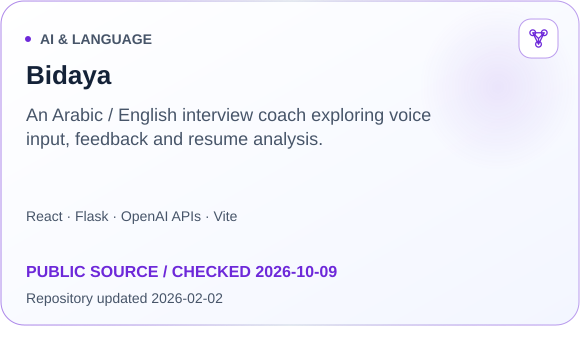
</picture></a>
<a href="https://github.com/Abdulrahman-S-Asiri/sentiment-analysis-project-Final"><picture>
  <source media="(max-width: 600px) and (prefers-color-scheme: dark)" srcset="assets/portfolio/sentiment-insight-mobile-dark.svg">
  <source media="(max-width: 600px) and (prefers-color-scheme: light)" srcset="assets/portfolio/sentiment-insight-mobile-light.svg">
  <source media="(prefers-color-scheme: dark)" srcset="assets/portfolio/sentiment-insight-dark.svg">
  <source media="(prefers-color-scheme: light)" srcset="assets/portfolio/sentiment-insight-light.svg">
  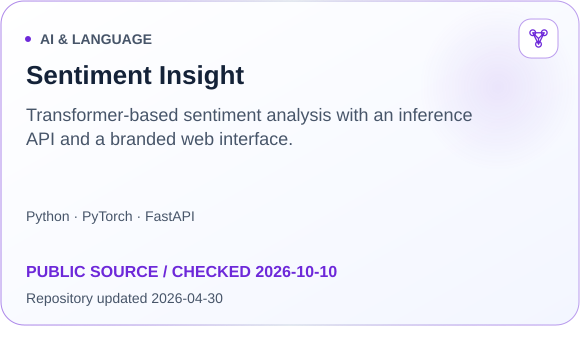
</picture></a>
<a href="https://github.com/Abdulrahman-S-Asiri/Mindmaps"><picture>
  <source media="(max-width: 600px) and (prefers-color-scheme: dark)" srcset="assets/portfolio/mindmaps-mobile-dark.svg">
  <source media="(max-width: 600px) and (prefers-color-scheme: light)" srcset="assets/portfolio/mindmaps-mobile-light.svg">
  <source media="(prefers-color-scheme: dark)" srcset="assets/portfolio/mindmaps-dark.svg">
  <source media="(prefers-color-scheme: light)" srcset="assets/portfolio/mindmaps-light.svg">
  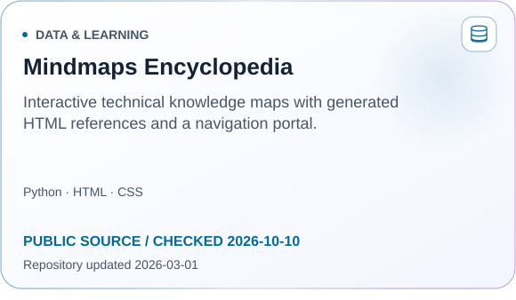
</picture></a>
<a href="https://github.com/Abdulrahman-S-Asiri/tasamuh-vr"><picture>
  <source media="(max-width: 600px) and (prefers-color-scheme: dark)" srcset="assets/portfolio/tasamuh-vr-mobile-dark.svg">
  <source media="(max-width: 600px) and (prefers-color-scheme: light)" srcset="assets/portfolio/tasamuh-vr-mobile-light.svg">
  <source media="(prefers-color-scheme: dark)" srcset="assets/portfolio/tasamuh-vr-dark.svg">
  <source media="(prefers-color-scheme: light)" srcset="assets/portfolio/tasamuh-vr-light.svg">
  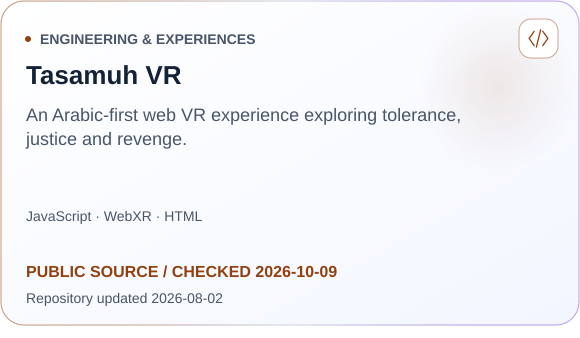
</picture></a>
<a href="https://github.com/Abdulrahman-S-Asiri/Cyber-Awareness"><picture>
  <source media="(max-width: 600px) and (prefers-color-scheme: dark)" srcset="assets/portfolio/cyber-awareness-mobile-dark.svg">
  <source media="(max-width: 600px) and (prefers-color-scheme: light)" srcset="assets/portfolio/cyber-awareness-mobile-light.svg">
  <source media="(prefers-color-scheme: dark)" srcset="assets/portfolio/cyber-awareness-dark.svg">
  <source media="(prefers-color-scheme: light)" srcset="assets/portfolio/cyber-awareness-light.svg">
  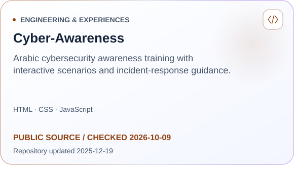
</picture></a>

### Published releases · آخر الإصدارات

No published stable releases were verified in this snapshot. Repository activity remains visible on each source card.

Source evidence and synchronization status

| Project | Source check | Latest stable release | Latest completed workflow on default branch |
|:---|:---|:---|:---|
| <a href="https://github.com/Abdulrahman-S-Asiri/saudi-market-intelligence">Saudi Market Intelligence</a> | current · 2026-10-09 | No stable release reported | No completed run reported |
| <a href="https://github.com/Abdulrahman-S-Asiri/Data_Science_Basics">Data Science Basics</a> | current · 2026-10-09 | No stable release reported | No completed run reported |
| <a href="https://github.com/Abdulrahman-S-Asiri/Bidaya_v2">Bidaya</a> | current · 2026-10-09 | No stable release reported | No completed run reported |
| <a href="https://github.com/Abdulrahman-S-Asiri/sentiment-analysis-project-Final">Sentiment Insight</a> | current · 2026-10-09 | No stable release reported | No completed run reported |
| <a href="https://github.com/Abdulrahman-S-Asiri/Mindmaps">Mindmaps Encyclopedia</a> | current · 2026-10-09 | No stable release reported | <a href="https://github.com/Abdulrahman-S-Asiri/Mindmaps/actions/runs/22548619511">pages build and deployment: success</a> · 2026-03-01 |
| <a href="https://github.com/Abdulrahman-S-Asiri/tasamuh-vr">Tasamuh VR</a> | current · 2026-10-09 | No stable release reported | No completed run reported |
| <a href="https://github.com/Abdulrahman-S-Asiri/Cyber-Awareness">Cyber-Awareness</a> | current · 2026-10-09 | No stable release reported | No completed run reported |

A workflow result describes that workflow only. Project scope, model calibration, production readiness and financial performance require their own evidence.

Discovery check: **current**. Add the `portfolio-profile` topic to an eligible public repository to include it automatically.

## Private work · ملخصات الأعمال الخاصة

These curated summaries reuse scope already published in this profile. Private repositories are not queried.

<picture>
  <source media="(max-width: 600px) and (prefers-color-scheme: dark)" srcset="assets/portfolio/stock-agents-mobile-dark.svg">
  <source media="(max-width: 600px) and (prefers-color-scheme: light)" srcset="assets/portfolio/stock-agents-mobile-light.svg">
  <source media="(prefers-color-scheme: dark)" srcset="assets/portfolio/stock-agents-dark.svg">
  <source media="(prefers-color-scheme: light)" srcset="assets/portfolio/stock-agents-light.svg">
  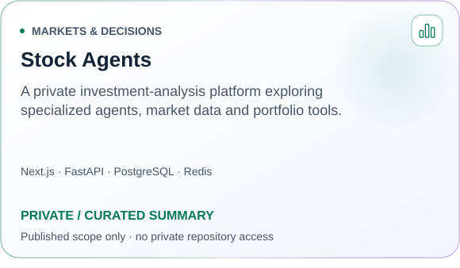
</picture>
<picture>
  <source media="(max-width: 600px) and (prefers-color-scheme: dark)" srcset="assets/portfolio/codeforge-mobile-dark.svg">
  <source media="(max-width: 600px) and (prefers-color-scheme: light)" srcset="assets/portfolio/codeforge-mobile-light.svg">
  <source media="(prefers-color-scheme: dark)" srcset="assets/portfolio/codeforge-dark.svg">
  <source media="(prefers-color-scheme: light)" srcset="assets/portfolio/codeforge-light.svg">
  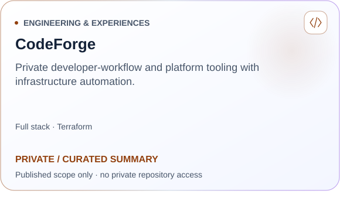
</picture>
<picture>
  <source media="(max-width: 600px) and (prefers-color-scheme: dark)" srcset="assets/portfolio/stock-101-mobile-dark.svg">
  <source media="(max-width: 600px) and (prefers-color-scheme: light)" srcset="assets/portfolio/stock-101-mobile-light.svg">
  <source media="(prefers-color-scheme: dark)" srcset="assets/portfolio/stock-101-dark.svg">
  <source media="(prefers-color-scheme: light)" srcset="assets/portfolio/stock-101-light.svg">
  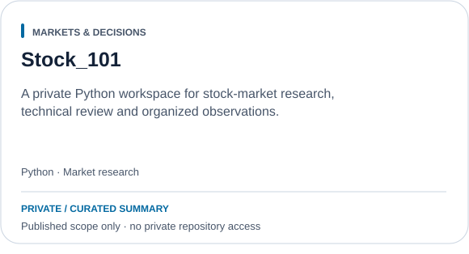
</picture>

<!-- portfolio:end -->

---

## About · نبذة

I'm **Abdulrahman Saad Asiri**, a **Data Engineer at stc**, AI engineer and learningholic based in **Riyadh, Saudi Arabia**.

I build across data engineering, data science, Arabic AI and financial-market research. My direction is practical agents, market-intelligence tools and systems that turn messy data into useful decisions.

**Currently learning:** production LLM architecture and the Chartered Market Technician program.

  <a href="https://www.linkedin.com/in/abdulrahman-saad-asiri-573ba1200">LinkedIn</a> ·
  <a href="https://x.com/D7oomyStay">X</a> ·
  <a href="https://huggingface.co/Abdulrahman-S-Asiri">Hugging Face</a> ·
  <a href="mailto:abdulrahman.s.alasiri@gmail.com">Email</a>

## Explore by interest · استكشف حسب اهتمامك

| Interest | Start here |
|:---|:---|
| Markets and decision tools | Saudi Market Intelligence; curated Stock Agents and Stock_101 summaries above |
| Arabic AI and applications | Bidaya, Sentiment Insight and the research links below |
| Data and learning | Data Science Basics and Mindmaps Encyclopedia |
| Engineering and experiences | Cyber-Awareness, Tasamuh VR and the curated CodeForge summary |

## Research and community · البحث والمجتمع

| Work listed in this portfolio | Focus |
|:---|:---|
| [SA-Retrieval Embeddings 0.2B](https://huggingface.co/Omartificial-Intelligence-Space/SA-Retrieval-Embeddings-0.2B) | Retrieval for Saudi Arabic and Modern Standard Arabic |
| [SAFIR Leaderboard](https://huggingface.co/spaces/NAMAA-Space/SAFIR-Leaderboard) | Arabic AI benchmarks and model evaluation |

Model-specific metrics, datasets and evaluation assumptions belong with their original sources.

## Technical range

| Layer | Tools and interests |
|:---|:---|
| Data | Python, SQL, pandas, NumPy, PostgreSQL, Redis, Jupyter, Tableau |
| Models | PyTorch, TensorFlow, Transformers, scikit-learn, XGBoost, embeddings, RAG, LLM agents |
| Services | FastAPI, Flask, REST APIs, WebSockets |
| Interfaces | TypeScript, JavaScript, React, Next.js, Vite, Tailwind CSS |
| Delivery | Git, Docker, Terraform, GitHub Actions |
| Research | Tadawul, US equities, technical analysis, portfolio analytics |

## Education and experience

- **Data Engineer** — stc (Saudi Telecom Company).
- **B.Sc. Computer Science** — Majmaah University.
- **Data Science & AI Bootcamp** — Tuwaiq Academy.
- **CMT candidate** — Chartered Market Technician program.
- **Data Scientist Associate** — DataCamp.
- **Deep Learning Fundamentals** — NVIDIA.
- **Investment Club:** Head of Investment Committees and Head of Financial Analysis.

## How I build

- Define the problem and choose the smallest useful implementation.
- Keep data contracts explicit and model behavior measurable.
- Verify the main workflow, failure cases and important assumptions.
- Explain decisions, limitations and evidence in the repository.
- Own the engineering decisions and disclose meaningful AI assistance.

[AI-assisted engineering method](docs/AI_ENGINEERING_METHOD.md) · [Repository launch playbook](docs/REPO_LAUNCH_PLAYBOOK.md)

## Keep this portfolio current

Public metadata is refreshed hourly and on portfolio configuration changes. Generated images are stored in this repository, with light and dark variants and text alternatives. A private project contributes only its curated public summary.

[Add a project, configure immediate refresh, or reproduce the portfolio locally](docs/LIVING_PORTFOLIO.md).

## Connect

Open to focused conversations around AI engineering, data platforms, Arabic NLP and market-intelligence research.

[LinkedIn](https://www.linkedin.com/in/abdulrahman-saad-asiri-573ba1200) · [Hugging Face](https://huggingface.co/Abdulrahman-S-Asiri) · [Email](mailto:abdulrahman.s.alasiri@gmail.com)
